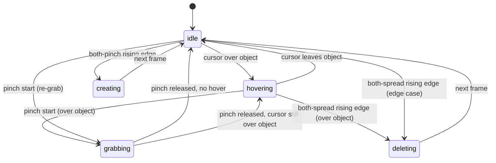
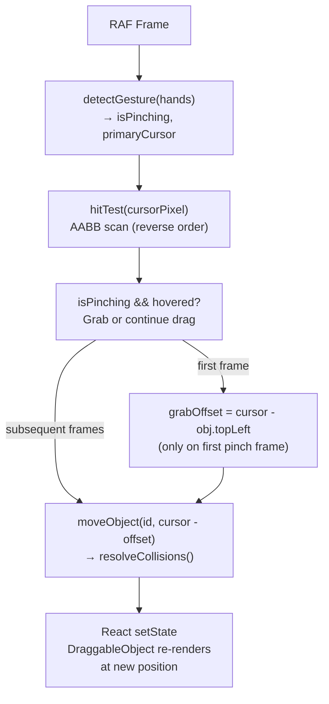
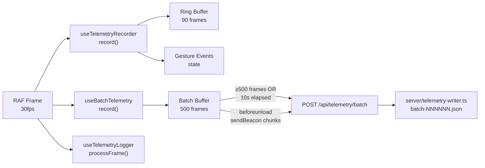

# Hands Tracker — Technical Manual

**Version:** 0.0.0  
**Stack:** React 19 · TypeScript 5.9 · Vite 8 · MediaPipe Tasks Vision  
**Testing:** Vitest 4 · React Testing Library 16  
**Date:** April 2026

---

## Table of Contents

1. [Executive Summary](#1-executive-summary)
2. [Project Overview](#2-project-overview)
3. [Architecture Overview](#3-architecture-overview)
4. [Hand Tracking Pipeline](#4-hand-tracking-pipeline)
5. [Gesture Detection System](#5-gesture-detection-system)
6. [Interaction Controller State Machine](#6-interaction-controller-state-machine)
7. [Hand Analysis Pipeline](#7-hand-analysis-pipeline)
8. [Object Management and Collision Physics](#8-object-management-and-collision-physics)
9. [Telemetry System](#9-telemetry-system)
10. [Mouse Fallback System](#10-mouse-fallback-system)
11. [Hook Reference](#11-hook-reference)
12. [Component Reference](#12-component-reference)
13. [Utilities Reference](#13-utilities-reference)
14. [Performance Architecture](#14-performance-architecture)
15. [Configuration and Setup](#15-configuration-and-setup)
16. [Data Flow Diagrams](#16-data-flow-diagrams)
17. [Testing Architecture](#17-testing-architecture)
18. [Deployment Considerations](#18-deployment-considerations)
19. [Appendix: Type Reference](#19-appendix-type-reference)

---

## 1. Executive Summary

Hands Tracker is a browser-based, fully client-side application that lets users manipulate DOM elements through webcam-tracked hand gestures. It captures video from the device camera, runs the MediaPipe Hands neural network model in a WebAssembly worker, and translates 21 three-dimensional hand landmarks into a rich set of interaction primitives at a target rate of 30 frames per second.

The central design philosophy is **zero React re-renders per frame on the hot path**. All frame-by-frame computation — physics, grip classification, cursor positioning, object movement — is driven through `useRef` and direct DOM manipulation. React's reactive state layer is used only for discrete, infrequent events such as gesture state transitions, object creation and deletion, and telemetry log entries.

The application supports two input modalities: real-time hand tracking (primary) and mouse input (fallback activated automatically when the camera is unavailable or denied). The two modalities share a common interaction state machine so the rest of the application does not need to distinguish between them.

An optional telemetry subsystem records per-frame physics snapshots into a ring buffer, detects discrete events such as claps, shakes, and velocity spikes, and batches data to a local server endpoint for offline analysis. Pressing `T` toggles a heads-up display showing hand skeletons, velocity vectors, a gesture timeline, and a live event log.

---

## 2. Project Overview

### 2.1 Purpose

The application serves two goals:

1. **Interaction prototype** — demonstrate that gesture-driven manipulation of DOM elements is viable at interactive frame rates, without any native plugin or WebSocket dependency.
2. **Telemetry research platform** — capture rich per-frame hand physics data for later analysis of user behavior, gesture ergonomics, and recognition algorithm tuning.

### 2.2 Supported Gestures

| Gesture | Trigger Condition | Action |
|---|---|---|
| Pinch | Thumb-tip to index-tip distance < 0.05 (normalized) | Grab and drag the nearest object |
| Release | Pinch distance rises above 0.07 | Release grabbed object |
| Partial grip | Hand openness ratio < 0.65 (left hand) | Grab with left hand (less precise, more permissive) |
| Both-hands pinch | Both hands simultaneously pinching | Create a new object at cursor position |
| Both-hands spread | Both hands simultaneously open, fingertip distances > 0.30 | Delete the hovered object |
| Shake (both hands) | Four or more direction reversals in a 15-frame window, speed > 0.30 | Clear all objects sequentially with 150 ms stagger |
| Clap | Two-phase: convergence (both hands moving toward each other fast) followed by impact (both slow and palms close, or one hand lost) | Triggers the `clap` telemetry event and the registered `onClapRef` callback |

### 2.3 Telemetry HUD Elements

When the `T` key toggles the overlay on, the following layers appear:

| Layer | Rendering | Description |
|---|---|---|
| Hand skeleton | Canvas (z-index 1101) | 21 landmarks connected by 27 bone segments, color-coded by per-landmark speed |
| Velocity vectors | Canvas (z-index 1102) | Arrows on the five fingertips scaled by speed |
| Gesture timeline | Canvas strip at bottom | Five-second scrolling history of gesture state and velocity spikes |
| Dual-hand HUD | Absolute div (top-left) | Per-hand palm velocity, wrist velocity, acceleration, axis, angular velocity, grip type, grip force, and finger curl bars |
| Event log | Absolute div (top-right) | Chronological list of detected events (clap, shake, grip change, velocity spike, etc.) |
| Grip indicator | SVG ring around cursor | Circular arc whose sweep angle reflects grip force (0–1), color-coded green/yellow/red |

### 2.4 Browser Requirements

- Chrome 100+, Firefox 100+, Edge 100+, Safari 16+ (macOS)
- HTTPS or `localhost` (camera API requirement)
- Webcam for hand tracking (mouse fallback operates without camera)
- GPU acceleration recommended (MediaPipe delegates to WebGL/GPU by default)

---

## 3. Architecture Overview

### 3.1 Layer Model

The application is organized into four horizontal layers:

```
┌─────────────────────────────────────────────────────────────────┐
│  Presentation Layer                                             │
│  React components: App, DraggableObject, DraggablePanel,        │
│  HandCursor, CameraPreview, TelemetryOverlay, and sub-views     │
├─────────────────────────────────────────────────────────────────┤
│  Interaction Layer                                              │
│  useInteractionController — state machine, grab/drag, shake     │
│  useGestureDetection — pinch/spread with hysteresis             │
│  useMouseFallback — mouse input normalization                   │
├─────────────────────────────────────────────────────────────────┤
│  Analysis Layer                                                 │
│  useHandAnalysis (compositor)                                   │
│    ├── useHandPhysics — velocity, acceleration, angular vel     │
│    ├── useGripDetection — finger curl, grip classification      │
│    └── useMotionRecognition — swipe, circular, static hold      │
├─────────────────────────────────────────────────────────────────┤
│  Sensing Layer                                                  │
│  useHandTracking — MediaPipe, camera, RAF detection loop        │
└─────────────────────────────────────────────────────────────────┘
```

### 3.2 Component Hierarchy

```
App
├── DraggableObject × N          (per managed object)
├── HandCursor                   (imperative, ref-driven)
├── GripIndicator                (imperative, ref-driven)
├── TelemetryOverlay
│   ├── HandSkeleton             (canvas)
│   ├── VelocityVectors          (canvas)
│   └── GestureTimeline          (canvas strip)
├── DraggablePanel (camera)
│   └── CameraPreview
├── DraggablePanel (event log)   [telemetry visible]
│   └── EventLog
└── DraggablePanel (HUD)         [telemetry visible]
    └── DualHandHUD
```

### 3.3 Hook Dependency Graph

```
App
├── useWindowSize
├── useHandTracking                    → hands[], isReady, error, videoRef
├── useGestureDetection                → detectGesture()
├── useMouseFallback                   → positionRef, isGrabbing, containerRef
├── useObjectManagement                → objects[], addObject, removeObject, moveObject, hitTest
├── useHandAnalysis                    → computeFrame(), physicsData, gripData, motionData, gripRef
│   ├── useHandPhysics
│   ├── useGripDetection
│   └── useMotionRecognition
├── useInteractionController           → update(), updateShake(), gestureState, hoveredId, ...
├── useTelemetryRecorder               → record(), gestureEvents, exportSession
├── useTelemetryLogger                 → processFrame(), log, onClapRef
├── useBatchTelemetry                  → record(), sessionId, batchCount
└── (inline ring buffer for timeline)
```

### 3.4 The RAF Loop

The entire interactive system is driven by a single `requestAnimationFrame` loop that lives in `App`. It runs unconditionally from mount to unmount. The loop is organized as a stable callback stored in a ref (`rafCallbackRef`) so that the RAF scheduling code itself never needs to be recreated:

```typescript
// Conceptual flow — see src/App.tsx
useEffect(() => {
  let rafId: number;
  function loop() {
    rafCallbackRef.current();  // always calls the latest version
    rafId = requestAnimationFrame(loop);
  }
  rafId = requestAnimationFrame(loop);
  return () => cancelAnimationFrame(rafId);
}, []);  // empty deps — runs once, cleans up on unmount
```

Within each frame, the execution order is:

1. FPS counter update
2. `computeFrame()` — physics, grip, motion analysis (writes to refs, throttled setState at 10 Hz)
3. `record()` (telemetry ring buffer) + `recordBatch()` (batch sender) + `processFrame()` (event detection)
4. `updateShake()` — shake-to-clear gesture check
5. `detectGesture()` — pinch/spread with hysteresis
6. `update()` — interaction state machine (cursor position, object drag, create/delete)
7. Imperative cursor DOM update via `style.transform`
8. Timeline ring buffer push + throttled reactive copy at 10 Hz

---

## 4. Hand Tracking Pipeline

### 4.1 Initialization Sequence

`useHandTracking` (`src/hooks/useHandTracking.ts`) handles the complete lifecycle of the camera and MediaPipe model.

```mermaid
sequenceDiagram
    participant App
    participant Hook as useHandTracking
    participant Browser
    participant CDN
    participant MP as MediaPipe WASM

    App->>Hook: mount
    Hook->>Browser: getUserMedia({ video: {w:640, h:480} })
    Browser-->>Hook: MediaStream
    Hook->>Browser: video.srcObject = stream; video.play()
    Browser-->>Hook: loadeddata event
    Hook->>CDN: FilesetResolver.forVisionTasks(WASM_CDN)
    CDN-->>Hook: vision fileset
    Hook->>CDN: HandLandmarker.createFromOptions(vision, options)
    CDN-->>Hook: HandLandmarker (GPU delegate, numHands=2)
    Hook->>Hook: setIsReady(true)
    Hook->>Browser: requestAnimationFrame(detectLoop)
    loop Every frame
        Browser->>Hook: detectLoop()
        Hook->>MP: detectForVideo(video, timestamp)
        MP-->>Hook: LandmarkResult[]
        Hook->>App: setHands(detected)
        Hook->>Browser: requestAnimationFrame(detectLoop)
    end
```

### 4.2 MediaPipe Configuration

```typescript
HandLandmarker.createFromOptions(vision, {
  baseOptions: {
    modelAssetPath: MODEL_ASSET_PATH,  // ~6 MB float16 model from Google Storage
    delegate: 'GPU',
  },
  numHands: 2,
  runningMode: 'VIDEO',
  minHandDetectionConfidence: 0.7,
  minHandPresenceConfidence: 0.7,
  minTrackingConfidence: 0.5,
});
```

The `GPU` delegate uses WebGL for inference, keeping the main thread free. `runningMode: 'VIDEO'` enables temporal tracking continuity across frames; this requires strictly monotonically increasing timestamps passed to `detectForVideo`, enforced by the `lastTimestampRef` guard.

### 4.3 Coordinate System

MediaPipe reports landmarks in a normalized space where `x` and `y` are in `[0, 1]` relative to the image frame, and `z` is the estimated depth relative to the wrist. The camera faces the user, so `x = 0` corresponds to the left side of the camera frame, which is the user's right side.

The application mirrors the X axis at the pixel conversion step:

```typescript
// src/utils/geometry.ts
export function normalizedToPixel(normalized, width, height) {
  return {
    x: (1 - normalized.x) * width,   // mirror X
    y: normalized.y * height,
  };
}
```

This ensures that moving your right hand to the right moves the cursor to the right on screen, matching user expectation.

### 4.4 The 21 Landmark Map

MediaPipe Hands provides 21 landmarks per hand:

```
Landmark 0:  Wrist
Landmarks 1–4:   Thumb  (CMC, MCP, IP, Tip)
Landmarks 5–8:   Index  (MCP, PIP, DIP, Tip)
Landmarks 9–12:  Middle (MCP, PIP, DIP, Tip)
Landmarks 13–16: Ring   (MCP, PIP, DIP, Tip)
Landmarks 17–20: Pinky  (MCP, PIP, DIP, Tip)
```

Key indices used throughout the codebase:
- `0` — wrist (used for palm centroid, angular velocity, physics seeding)
- `4` — thumb tip (pinch detection)
- `8` — index finger tip (cursor position, pinch detection)
- `5, 9, 13, 17` — finger base knuckles (palm velocity average)

### 4.5 Cleanup

On unmount, the hook cancels the animation frame, calls `landmarker.close()` to release GPU/WASM resources, stops all MediaStream tracks, and nulls `video.srcObject` to release the browser's MediaStream reference. A `cancelled` flag prevents state updates on the async initialization path if the component unmounts before the model finishes loading.

---

## 5. Gesture Detection System

### 5.1 Responsibilities

`useGestureDetection` (`src/hooks/useGestureDetection.ts`) is a pure gesture detection hook with no scene or object awareness. It:

- Tracks the primary hand's index-finger-tip position with lerp smoothing
- Detects single-hand pinch with hysteresis
- Detects both-hands pinch and both-hands spread

It returns a stable `detect(hands): GestureResult` callback.

### 5.2 Hysteresis for Pinch Detection

Hysteresis prevents the pinch state from toggling rapidly when the thumb-index distance hovers near the threshold. Two thresholds are used:

```
PINCH_ENTER_THRESHOLD = 0.05   (normalized distance — ~6% of frame width)
PINCH_EXIT_THRESHOLD  = 0.07   (must spread wider to release)
```

Logic per hand per frame:

```typescript
if (wasPinching) {
  isPinching = dist < PINCH_EXIT_THRESHOLD;  // stay pinching until clearly released
} else {
  isPinching = dist < PINCH_ENTER_THRESHOLD; // enter only when clearly pinched
}
```

This is implemented purely in refs (`pinchStateRef`) — no re-renders triggered.

### 5.3 Cursor Smoothing

Raw landmark positions jitter at the sub-pixel level due to network processing and sensor noise. A lerp is applied every frame:

```typescript
const LERP_FACTOR = 0.3;  // 0 = perfectly smooth (no movement), 1 = raw (no smoothing)

smoothCursorRef.current = {
  x: lerp(smoothCursorRef.current.x, rawCursor.x, LERP_FACTOR),
  y: lerp(smoothCursorRef.current.y, rawCursor.y, LERP_FACTOR),
};
```

A factor of 0.3 provides ~70% of a first-order lag filter, meaning the displayed cursor converges to a new position over roughly 3 frames, eliminating jitter without making the cursor feel sluggish.

### 5.4 Primary Hand Selection

When two hands are detected, the right hand is preferred as primary (drives the cursor). The left hand can independently grab objects via `partialLowGrabLeftRef` in the interaction controller. If only one hand is present regardless of handedness, it becomes primary.

### 5.5 GestureResult Type

```typescript
interface GestureResult {
  primaryCursor: { x: number; y: number } | null;  // smoothed, normalized
  isPinching: boolean;          // primary hand
  isBothPinching: boolean;      // both hands simultaneously pinching
  isBothSpreading: boolean;     // both hands simultaneously spreading
}
```

---

## 6. Interaction Controller State Machine

### 6.1 Overview

`useInteractionController` (`src/hooks/useInteractionController.ts`) is the central state machine. It receives all relevant input each frame through a single `update(input): Result | null` call and produces:

- A resolved `GestureState` (`idle | hovering | grabbing | creating | deleting`)
- The cursor pixel position for the frame
- Side effects: object creation, deletion, movement

### 6.2 State Transitions



The `creating` and `deleting` states last exactly one frame. They exist so the cursor and HUD reflect the momentary action visually before the state reverts to `idle` or `hovering`.

### 6.3 Rising-Edge Detection

Both-pinch (create) and both-spread (delete) use rising-edge detection to fire exactly once per gesture:

```typescript
const bothSpreadingRising = isBothSpreading && !prevBothSpreadingRef.current;
const bothPinchingRising  = isBothPinching  && !prevBothPinchingRef.current;
prevBothSpreadingRef.current = isBothSpreading;
prevBothPinchingRef.current  = isBothPinching;
```

Without this, holding both hands pinched would create objects every frame at 30 fps.

### 6.4 Dual-Hand Grab

The right hand is the primary cursor and grabs objects via pinch. The left hand grabs independently using a "partial low grip" signal from `useGripDetection`:

```
left openness ratio < 0.65  →  left grab active
left openness ratio > 0.80  →  left grab released  (hysteresis: 0.65 entry, 0.80 exit)
```

Each hand tracks its own grabbed object ID (`grabbedId` for right, `grabbedIdLeft` for left) and its own grab offset (the point on the object where the hand first touched, so the object does not snap to center). Both hands can simultaneously hold different objects.

### 6.5 Edge Warning

The controller monitors whether any hand landmark (wrist `[0]` or index tip `[8]`) is within 8% of the frame boundary (`EDGE_THRESHOLD = 0.08`). Three states:

| State | Condition | Visual Effect |
|---|---|---|
| `none` | Hands visible and not near edge | No border |
| `near` | Any landmark within edge threshold | Pulsing orange border |
| `out` | Camera ready but no hands detected | Solid red border |

### 6.6 Shake-to-Clear

`updateShake` (separate from `update` so it can receive physics data) implements the shake gesture:

1. Both hands must be present.
2. The fastest palm speed must exceed `SHAKE_CLEAR_VELOCITY = 0.3` (normalized/sec).
3. Direction reversals in the last 15 direction samples must reach `SHAKE_CLEAR_REVERSALS = 4`.
4. A 2-second debounce prevents re-triggering.

When triggered, each object is removed with a 150 ms stagger:

```typescript
ids.forEach((id, i) => {
  const tid = window.setTimeout(() => {
    removeObject(id);
    if (i === ids.length - 1) shakeClearingRef.current = false;
  }, i * 150);
});
```

### 6.7 Ref/State Mirror Pattern

All reactive state has a matching ref that is kept in sync. This allows the `update` callback (called inside the RAF loop) to read the current values without becoming a stale closure, while React still knows when to re-render:

```typescript
const [gestureState, setGestureState] = useState<GestureState>('idle');
const gestureStateRef = useRef<GestureState>('idle');

const applyGestureState = useCallback((s: GestureState) => {
  if (gestureStateRef.current !== s) {
    gestureStateRef.current = s;  // immediate, synchronous
    setGestureState(s);           // async React update
  }
}, []);
```

The equality check before `setState` prevents spurious React renders when the state does not actually change (which is the case for the majority of frames where the user is in `idle`).

---

## 7. Hand Analysis Pipeline

### 7.1 Composition

`useHandAnalysis` (`src/hooks/useHandAnalysis.ts`) composes three specialized hooks and provides a unified `computeFrame()` interface:

```
computeFrame(hands, timestamp)
    ├── computePhysics(hands, timestamp)  →  HandPhysics[]
    ├── detectGrip(hands, timestamp)      →  GripState[]
    └── classifyMotion(physics, timestamp) →  MotionPattern[]
```

The raw results are written to refs on every frame. A throttled `setState` fires at most once every 100 ms (~10 Hz) for UI consumers. Latency-sensitive consumers (such as panel drag detection) read directly from `gripRef.current`.

### 7.2 Physics — `useHandPhysics`

**Location:** `src/hooks/useHandPhysics.ts`

#### Per-landmark velocity

Finite difference between consecutive frames, converted to units/second:

```
v[i] = (pos[i][t] - pos[i][t-1]) / deltaSeconds
```

An exponential moving average (EMA) with `alpha = 0.4` smooths the velocity before it is stored in the frame cache:

```
smoothed = 0.4 * rawVelocity + 0.6 * prevSmoothed
```

#### Whole-hand metrics

| Metric | Computation |
|---|---|
| `wristVelocity` | Smoothed velocity of landmark 0 |
| `palmVelocity` | Average of smoothed velocities at landmarks `[0, 5, 9, 13, 17]` |
| `angularVelocity` | `acos(dot(normalize(normal_t), normalize(normal_{t-1}))) / deltaSeconds` where normal is `cross(lm[5]-lm[0], lm[17]-lm[0])` |
| `dominantAxis` | Axis with largest absolute component of `palmVelocity`; `none` if all below 0.01 |

#### Frame cache

The hook maintains a `frameCache` keyed by handedness (`'Left' | 'Right'`). When a hand disappears and reappears, it gets a fresh zeroed physics entry for one frame before normal computation resumes.

### 7.3 Grip Detection — `useGripDetection`

**Location:** `src/hooks/useGripDetection.ts`

#### Finger curl

Each finger's curl is computed from the bone-angle method using the PIP joint as the pivot:

```
bone1 = normalize(MCP - PIP)   # proximal direction
bone2 = normalize(TIP - PIP)   # distal direction
angle = acos(clamp(dot(bone1, bone2), -1, 1))
curl  = clamp(1 - angle / PI, 0, 1)
```

`curl = 0` is fully extended; `curl = 1` is fully folded back. The PIP joint is chosen because it has the largest angular range and gives the cleanest signal compared to MCP or DIP.

#### Openness ratio

The openness ratio excludes the thumb (which is anatomically orthogonal to the other fingers and would distort the average):

```
openness = clamp(1 - (index + middle + ring + pinky) / 4, 0, 1)
```

#### Grip force

The grip force is the rate of closure, clamped to `[0, 1]`:

```
gripForce = clamp(-(openness[t] - openness[t-1]) / deltaSeconds, 0, 1)
```

A high positive value means the hand is closing rapidly. This is displayed as the SVG ring arc around the cursor.

#### Grip type classification

Classification uses hardcoded curl thresholds, evaluated in priority order:

| Type | Condition |
|---|---|
| `fist` | All five curls > 0.7 |
| `open` | All five curls < 0.3 |
| `pinch` | Thumb < 0.3, index < 0.3, others > 0.5, thumb-index 3D distance < 0.05 |
| `point` | Index < 0.3, middle/ring/pinky > 0.6 |
| `partial` | Everything else |

#### Hysteresis for grip type

A candidate type must persist for `HYSTERESIS_FRAMES = 3` consecutive frames before the confirmed type switches. This prevents single-frame misfires from changing the displayed grip state.

### 7.4 Motion Recognition — `useMotionRecognition`

**Location:** `src/hooks/useMotionRecognition.ts`

The hook maintains a ring buffer of `BUFFER_CAPACITY = 30` `FrameSnapshot` entries, each containing `palmVelocity`, speed, timestamp, and `atan2(vy, vx)` angle.

Pattern detection priority (first match wins):

1. **Swipe** — five or more consecutive frames with the same dominant axis (X or Y) above `0.8` units/sec and consistent sign.
2. **Circular** — accumulated angle across the whole buffer exceeds 2π; smoothness measured by reversal count.
3. **Acceleration burst** — current speed > 0.5 and the frame three positions back had speed < 0.1.
4. **Static hold** — fifteen consecutive frames all below `0.02` units/sec.
5. **None** — default.

The `wrapAngleDelta` utility normalizes angle differences to `[-π, π]` to correctly handle the discontinuity at ±π when tracking circular motion.

---

## 8. Object Management and Collision Physics

### 8.1 Object Lifecycle

`useObjectManagement` (`src/hooks/useObjectManagement.ts`) owns the authoritative list of `DraggableObjectData` objects. It exposes five stable callbacks:

| Callback | Description |
|---|---|
| `addObject(position)` | Creates a new 80×80 object at position; debounced 500 ms; max 20 objects |
| `removeObject(id)` | Removes by id; triggers collision resolution is not needed |
| `moveObject(id, position)` | Moves to position, clamped to screen, then resolves collisions |
| `hitTest(cursor)` | O(n) reverse scan of objectsRef — stable callback, never needs recreation |
| `clearAll()` | Removes all objects |

On creation, the hook attempts to find a non-overlapping position by trying up to 50 random placements. After each `addObject` or `moveObject`, the collision resolver runs.

### 8.2 Initial Placement

The `initialCount` parameter (currently `0` in the `App`) causes `buildInitialObjects` to pre-populate the scene with objects in non-overlapping positions. The random placement attempts use the same `objectsOverlap` AABB test to validate each candidate position.

### 8.3 AABB Collision Resolution

**Location:** `src/utils/collision.ts`

The resolver runs up to `COLLISION_ITERATIONS = 3` passes over all object pairs. In each pass, overlapping pairs are separated along the axis of minimum overlap:

```
overlapX = min(a.x + a.width  - b.x, b.x + b.width  - a.x)
overlapY = min(a.y + a.height - b.y, b.y + b.height - a.y)

if overlapX < overlapY:
    push along X axis
else:
    push along Y axis
```

The moved object (`movedId`) is treated as immovable (it stays at the cursor position). Other objects receive the full push. If neither is the moved object, the push is split 50/50.

After each separation, both objects are re-clamped to screen bounds. Three passes handle chains of overlapping objects (moving one object that pushes another that pushes a third).

### 8.4 objectsRef Pattern

`hitTest` is called 30 times per second from inside the RAF loop. It must be a stable callback (never recreated) that always reads the current object list. This is achieved with the `objectsRef` pattern:

```typescript
const objectsRef = useRef<DraggableObjectData[]>(objects);
objectsRef.current = objects;  // kept in sync on every render

const hitTest = useCallback(
  (cursor) => {
    const objs = objectsRef.current;  // always current, no stale closure
    // scan from back to front (last rendered = topmost)
    for (let i = objs.length - 1; i >= 0; i--) {
      if (aabbHitTest(cursor, objs[i])) return objs[i].id;
    }
    return null;
  },
  [],  // stable: objectsRef never changes identity
);
```

### 8.5 DraggableObject Rendering

`DraggableObject` is a `React.memo`-wrapped component that renders an absolutely positioned `<div>`. Position is stored in React state (it changes discrete, not every frame). State styles (scale, box-shadow, z-index) are computed by `getStateStyles` based on `isHovered` and `isGrabbed` props:

| State | Transform | Box Shadow | Cursor |
|---|---|---|---|
| idle | `scale(1)` | `0 2px 8px rgba(0,0,0,0.15)` | `grab` |
| hovered | `scale(1.02)` | `0 3px 12px rgba(0,0,0,0.2)` | `grab` |
| grabbed | `scale(1.05)` | Blue glow + depth shadow | `grabbing` |

CSS transitions of 150 ms on `transform` and `box-shadow` smooth the state changes.

---

## 9. Telemetry System

The telemetry system has three cooperating components: a ring buffer recorder (`useTelemetryRecorder`), an event logger (`useTelemetryLogger`), and a batch network writer (`useBatchTelemetry`). On the server side, a Vite plugin middleware handles requests and a file writer persists data.

### 9.1 Ring Buffer Recorder — `useTelemetryRecorder`

**Location:** `src/hooks/useTelemetryRecorder.ts`

Maintains a fixed-capacity ring buffer of `HandTelemetry` frames (default `capacity = 90`, equivalent to 3 seconds at 30 fps). The buffer overwrites the oldest entry when full:

```typescript
const slot = buffer.head % capacity;
buffer.frames[slot] = frame;
buffer.head++;
buffer.size = Math.min(buffer.size + 1, capacity);
```

In addition to raw frame data, the recorder detects **state transition events** (grip type changes and motion pattern changes) and emits `GestureEvent` objects. It maps grip type changes to gesture event types via:

```
GripType  →  GestureType
'open'    →  'open-palm'
'fist'    →  'fist'
'point'   →  'point'
'pinch'/'partial'  →  (no event)
```

Events are accumulated in React state (capped at 1000 entries) so they survive for the session export.

The `exportSession()` function linearizes the ring buffer in chronological order and packages it with all events and a computed sample rate into a `TelemetrySession` object suitable for JSON download.

### 9.2 Event Logger — `useTelemetryLogger`

**Location:** `src/hooks/useTelemetryLogger.ts`

Detects nine categories of discrete events:

| Event Type | Detection Method |
|---|---|
| `velocity-spike` | Palm speed > 0.4, debounced 300 ms |
| `shake` | Four or more direction reversals in last 15 frames at speed > 0.15 |
| `acceleration-burst` | Acceleration > 0.3 and hand was not previously moving |
| `sudden-stop` | Was moving, now speed < 0.05 |
| `grip-change` | Grip type changes from last recorded type |
| `motion-detected` | Motion pattern changes and confidence > 0.5 |
| `clap` | Two-phase detection (see below) |
| `snapshot` | Periodic every 1 second (filtered from UI display) |
| `object-*` | Injected externally (not yet implemented in current version) |

**Clap detection** uses a two-phase algorithm:
- **Phase 1 (convergence):** Both hands fast (speed > 0.4) and converging in X (opposite horizontal velocities) → set `converging = true`.
- **Phase 2 (impact):** Within 500 ms of convergence, either:
  - Both hands have slowed (speed < 0.15) AND palms are close (`|leftPalm.x - rightPalm.x| < 0.15`)
  - One hand disappears (palms collided and occluded MediaPipe's view of the second hand)

A 1500 ms debounce prevents double-detection from the bounce after a real clap.

The logger exposes an `onClapRef` mutable ref that callers can set to a callback. This avoids prop drilling without creating a Context.

### 9.3 Batch Writer — `useBatchTelemetry`

**Location:** `src/hooks/useBatchTelemetry.ts`

Accumulates `HandTelemetry` frames in a buffer and periodically flushes them to `POST /api/telemetry/batch`. Two flush triggers:

1. **Frame count** — buffer reaches `maxFrames` (default: 500 frames)
2. **Time interval** — `maxIntervalMs` has elapsed since last flush (default: 10 seconds), checked by a 1 Hz `setInterval`

**Retry logic:** Failed fetch requests are added to a `retryQueueRef`. On the next flush, retry items are processed first (using the same serialized payload). A batch is dropped after `MAX_RETRIES = 3` attempts. The retry queue is capped at `MAX_RETRY_QUEUE = 10` items to bound memory usage.

**Unload flush:** On `beforeunload`, remaining frames are sent via `navigator.sendBeacon` in chunks of `BEACON_CHUNK_SIZE = 15` frames (~45 KB per chunk, safely under sendBeacon's 64 KB limit). A session summary is also beaconed to `/api/telemetry/session-end`.

**Performance note:** The `record()` function never calls `setState`. The only React state updates are `setBatchCount` and `setPendingFrames`, which are driven by the 1 Hz interval, not the 30 Hz frame loop.

### 9.4 Server-Side Writer — `server/telemetry-writer.ts`

**Location:** `server/telemetry-writer.ts`

Writes batch data to the filesystem under `./telemetry-data/{date}/{sessionId}/`:

- `batch-000001.json` — individual frame batches (sequence number zero-padded to 6 digits)
- `session-summary.json` — session metadata (overwritten on each end-of-session call)

Security measures:
- Session ID validated against `/^[a-zA-Z0-9][a-zA-Z0-9_-]{0,127}$/`
- Sequence numbers validated to be in `[0, 999999]`
- Timestamps validated against a minimum of 2000-01-01 (guards against zero or negative values)
- Frame and event counts capped at 10,000 per batch
- Batch files use `open(path, 'wx')` (exclusive create) — duplicate sequence numbers silently skip

### 9.5 Vite Plugin — `vite-plugin-telemetry.ts`

**Location:** `vite-plugin-telemetry.ts`

Implements a Vite `configureServer` middleware that intercepts `POST /api/telemetry/batch` and `POST /api/telemetry/session-end` during development. Body size is limited to 5 MB; oversized bodies receive a 413 response.

The plugin is only active during `vite dev`. For production deployment, an equivalent server-side handler must be implemented.

### 9.6 Timeline Ring Buffer

The `App` component maintains its own 300-entry ring buffer for the `GestureTimeline` component. This buffer is separate from the telemetry buffer because it holds a different data shape (`TimelineEntry`) and needs to be readable at ~10 Hz for the canvas render:

```typescript
const TIMELINE_CAPACITY = 300;  // 10 seconds at 30fps
```

Entries are pushed synchronously on every frame. A throttled `setTimelineEntries` fires at most every 100 ms to avoid re-rendering the timeline canvas at 30 fps.

---

## 10. Mouse Fallback System

`useMouseFallback` (`src/hooks/useMouseFallback.ts`) provides a complete alternative input when the camera is unavailable. It is transparent to the interaction controller, which accepts either hand or mouse input through the same `UpdateInput` interface.

**Key design choices:**

- `positionRef` stores mouse position updated on every `mousemove` with zero re-renders
- `isGrabbing` is reactive state (because it drives visual changes to the cursor)
- `position` (reactive copy) is updated only on `mousedown`, not on every move, to avoid renders
- The container element (`containerRef`) normalizes mouse coordinates to `[0, 1]`, matching the hand tracking coordinate space

When `useHands` is false in the interaction controller, cursor position comes from `normalizedToPixel(mousePos, W, H)` and `isPinching` comes from `mouseGrabbing`. The two-hand gestures (both-pinch, both-spread) are unavailable in mouse mode.

---

## 11. Hook Reference

### `useHandTracking`

**File:** `src/hooks/useHandTracking.ts`  
**Returns:** `{ hands: HandData[], isReady: boolean, error: string | null, videoRef }`

Manages the complete camera and MediaPipe lifecycle. Runs its own RAF loop internally for `detectForVideo` calls. Sets `hands` state on every frame when landmarks are detected, or to `[]` when no hands are visible.

---

### `useGestureDetection`

**File:** `src/hooks/useGestureDetection.ts`  
**Returns:** `detect: (hands: HandData[]) => GestureResult`

Stateless from the caller's perspective — all state is internal refs. Applies lerp smoothing to the cursor position and hysteresis to pinch detection. Should be called once per frame.

---

### `useHandAnalysis`

**File:** `src/hooks/useHandAnalysis.ts`  
**Returns:** `{ physicsData, gripData, motionData, gripRef, computeFrame }`

Compositor for physics, grip, and motion. `computeFrame` should be called once per frame. `physicsData/gripData/motionData` update at ~10 Hz for UI; `gripRef.current` is live (every frame).

---

### `useHandPhysics`

**File:** `src/hooks/useHandPhysics.ts`  
**Returns:** `compute: (hands: HandData[], timestamp: number) => HandPhysics[]`

Computes EMA-smoothed per-landmark velocity and acceleration, plus whole-hand aggregates. Uses a `frameCache` keyed by handedness to track inter-frame state. Zero re-renders.

---

### `useGripDetection`

**File:** `src/hooks/useGripDetection.ts`  
**Returns:** `detect: (hands: HandData[], timestamp: number) => GripState[]`

Computes finger curl, openness ratio, grip force, and classifies grip type with 3-frame hysteresis. Zero re-renders.

---

### `useMotionRecognition`

**File:** `src/hooks/useMotionRecognition.ts`  
**Returns:** `classify: (physics: HandPhysics, timestamp: number) => MotionPattern`

Maintains a 30-frame ring buffer per hand instance. Detects swipe, circular, acceleration burst, and static hold in priority order.

---

### `useInteractionController`

**File:** `src/hooks/useInteractionController.ts`  
**Returns:** `{ gestureState, hoveredId, grabbedId, grabbedIdLeft, edgeWarning, update, updateShake }`

Central state machine. `update` and `updateShake` are called from the RAF loop. Reactive state updates only on meaningful transitions. Manages dual-hand grab, create, delete, and edge detection.

---

### `useObjectManagement`

**File:** `src/hooks/useObjectManagement.ts`  
**Returns:** `{ objects, addObject, removeObject, moveObject, hitTest, clearAll }`

Owns the object list in React state. All callbacks are stable. `hitTest` reads from `objectsRef` to avoid stale closures. Collision resolution runs after every `addObject` and `moveObject`.

---

### `useObjectTracker`

**File:** `src/hooks/useObjectTracker.ts`  
**Returns:** `{ tracked, update, getMovingObjects, getGrabbedObjects }`

Maintains per-object velocity and grab state between frames. Not currently used in the main RAF loop but available as a utility for downstream analysis. Detects grab-start (resets distance counter) and release (encodes with negative `totalDistance` for signaling).

---

### `useTelemetryRecorder`

**File:** `src/hooks/useTelemetryRecorder.ts`  
**Returns:** `{ bufferRef, gestureEvents, exportSession, reset, record }`

Ring buffer for raw frame snapshots. Detects grip and motion state transitions and emits `GestureEvent` objects. `exportSession` serializes the buffer chronologically.

---

### `useTelemetryLogger`

**File:** `src/hooks/useTelemetryLogger.ts`  
**Returns:** `{ log, processFrame, addEntry, clearLog, exportLog, onClapRef }`

Event detection and logging. `processFrame` is called once per frame. Events are capped at 500 log entries. `onClapRef` allows external code to register a clap callback without prop drilling.

---

### `useBatchTelemetry`

**File:** `src/hooks/useBatchTelemetry.ts`  
**Returns:** `{ record, sessionId, batchCount, pendingFrames }`

Network batch writer. Accumulates frames in a buffer, flushes on count or interval trigger, retries failed requests, and uses `sendBeacon` on unload. Zero re-renders in `record()`.

---

### `useMouseFallback`

**File:** `src/hooks/useMouseFallback.ts`  
**Returns:** `{ positionRef, position, isGrabbing, containerRef }`

Mouse position tracked in a ref (no mousemove re-renders). `isGrabbing` is reactive because it changes visual state. Normalizes coordinates to `[0, 1]` relative to the container element.

---

### `usePanelCollisions`

**File:** `src/hooks/usePanelCollisions.ts`  
**Returns:** `{ register, unregister, updatePosition }`

Not currently wired into the App but implemented as a collision manager for draggable panels. Maintains a Map of registered panels by id. `updatePosition` clamps the moved panel and pushes other registered panels away with a 4 px gap, applying changes directly to the DOM element's `style` for immediate responsiveness.

---

### `useWindowSize`

**File:** `src/hooks/useWindowSize.ts`  
**Returns:** `{ width: number, height: number }`

Reactive window dimensions with a 150 ms debounce on resize. Used by `App` to recompute pixel conversions and position panels after a resize.

---

## 12. Component Reference

### `App`

**File:** `src/App.tsx`

The root component. Owns the RAF loop, composes all hooks, manages the `telemetryVisible` state and the `fps` counter, maintains the timeline ring buffer, and renders all top-level children. Exposes no props.

**Performance-critical patterns used:**
- All hot-path values stored in refs and synchronized from state using the `handsRef`, `objectsRef`, `isReadyRef` pattern
- `panelHandCursors` memoized with `useMemo` (recalculates when `hands` or `W/H` changes)
- `borderStyle` memoized with `useMemo` (recalculates when `edgeWarning` changes)
- `MemoEventLog` and `MemoDualHandHUD` wrapped with `React.memo` to prevent re-renders when parents re-render

---

### `DraggableObject`

**File:** `src/components/DraggableObject.tsx`  
**Props:** `DraggableObjectData & { isHovered: boolean, isGrabbed: boolean }`

`React.memo`-wrapped. Renders an absolutely positioned colored rectangle. Position is driven by React state (only changes on discrete events). Visual state (scale, shadow) computed by `getStateStyles`. No event handlers — all interaction is handled by the controller.

---

### `DraggablePanel`

**File:** `src/components/DraggablePanel.tsx`  
**Props:** `{ children, initialX, initialY, handCursors? }`

A draggable container for UI panels. Supports both mouse drag and hand cursor drag. Maintains position in React state. The hand-cursor tracking runs its own internal RAF loop that reads from `handCursorsRef` (a ref that stays updated with the latest prop value) to avoid re-subscribing the effect every frame. Drag offset is stored in a ref for latency-free reading during dragging.

Panel position is clamped to screen bounds using the actual DOM element dimensions (via `el.offsetWidth / offsetHeight`).

---

### `HandCursor`

**File:** `src/components/HandCursor.tsx`  
**Props:** `{ gestureState: GestureState }`  
**Ref:** `HTMLDivElement`

A `React.forwardRef` + `React.memo` component. Renders a circle that is positioned imperatively via `style.transform = translate3d(...)` from the RAF loop. The `translate3d` form triggers GPU compositing without layout recalculation. Visual properties (size, color, shadow) change based on `gestureState` with 150 ms CSS transitions.

---

### `CameraPreview`

**File:** `src/components/CameraPreview.tsx`  
**Props:** `{ videoRef, visible }`

Renders the live camera feed with a macOS-inspired title bar. The video element is horizontally mirrored via `transform: scaleX(-1)` so the preview looks like a mirror (natural for the user). Collapsible via a Show/Hide button.

---

### `TelemetryOverlay`

**File:** `src/components/telemetry/TelemetryOverlay.tsx`  
**Props:** `{ visible, onToggle, children }`

A transparent overlay container (`position: absolute; inset: 0; pointer-events: none`). Registers a `keydown` listener for `T`/`t` to toggle visibility. Returns `null` when not visible.

---

### `HandSkeleton`

**File:** `src/components/telemetry/HandSkeleton.tsx`  
**Props:** `{ hands, physicsData, workspaceWidth, workspaceHeight }`

Canvas component. On each render (driven by `useEffect` with `[hands, physicsData, width, height]` deps), clears and redraws 27 bone segments and 21 landmark circles. Bones are colored by the average speed of their two endpoints using `speedToColor`. Landmark indices are labeled in white.

Bone connections follow the MediaPipe topology:
```
Thumb:   [0,1], [1,2], [2,3], [3,4]
Index:   [0,5], [5,6], [6,7], [7,8]
Middle:  [0,9], [9,10], [10,11], [11,12]
Ring:    [0,13], [13,14], [14,15], [15,16]
Pinky:   [0,17], [17,18], [18,19], [19,20]
Palm:    [5,9], [9,13], [13,17]
```

---

### `VelocityVectors`

**File:** `src/components/telemetry/VelocityVectors.tsx`  
**Props:** `{ hands, physicsData, workspaceWidth, workspaceHeight }`

Canvas component. Draws velocity arrows on the five fingertips (landmarks 4, 8, 12, 16, 20). Arrow length is `min(speed * 4, 60)` pixels. The X component of velocity is negated before computing `atan2` to account for the mirrored coordinate system. Only draws arrows when speed > 1.

---

### `DualHandHUD`

**File:** `src/components/telemetry/DualHandHUD.tsx`  
**Props:** `{ physicsData, gripData, motionData, fps }`

`React.memo`-wrapped. Shows FPS, hand count, and per-hand panels (right hand first). Each hand panel shows: palm velocity, wrist velocity, acceleration, dominant axis, angular velocity, grip type, grip force percentage, and finger curl bars (one bar per finger, color-coded green/yellow/red). Updates at ~10 Hz due to the throttle in `useHandAnalysis`.

---

### `GestureTimeline`

**File:** `src/components/telemetry/GestureTimeline.tsx`  
**Props:** `{ entries: TimelineEntry[], workspaceWidth }`

Canvas strip (56 px tall) pinned to the bottom of the screen. Draws a full-width color-coded gesture state history for the last 5 seconds, plus yellow vertical ticks for velocity spikes above 15 units/s. A white line marks the current moment at the right edge. Updates at ~10 Hz (fed by the throttled `timelineEntries` state in App).

---

### `EventLog`

**File:** `src/components/telemetry/EventLog.tsx`  
**Props:** `{ entries, onClear, onExport }`

Scrollable list of telemetry events. Filters out `snapshot` entries (too noisy for display). Shows the last 50 visible entries. Auto-scrolls to the bottom on new entries using a `useEffect` that watches `entries.length`. Each event type has a color dot. Export button serializes all events (including snapshots) to JSON.

---

### `GripIndicator`

**File:** `src/components/telemetry/GripIndicator.tsx`  
**Props:** `{ gripConfidence: number, visible: boolean }`  
**Ref:** `HTMLDivElement`

`React.forwardRef` + `React.memo` component. Renders an SVG circle with a stroke dash offset that represents grip force as a circular arc. Positioned imperatively alongside `HandCursor` via `style.transform`. The SVG is rotated -90° so the arc starts at the top. Color follows `gripColor`.

---

## 13. Utilities Reference

### `src/utils/geometry.ts`

Pure, stateless 2D/3D math utilities:

| Function | Signature | Description |
|---|---|---|
| `distance` | `(a, b) → number` | Euclidean 2D distance |
| `lerp` | `(current, target, factor) → number` | Linear interpolation |
| `normalizedToPixel` | `(norm, w, h) → {x, y}` | Normalized to pixel with X mirror |
| `hitTest` | `(cursor, obj) → boolean` | AABB containment test |
| `clamp` | `(v, min, max) → number` | Value clamping |
| `distance3d` | `(a, b) → number` | Euclidean 3D distance |
| `dot3` | `(a, b) → number` | 3D dot product |
| `cross3` | `(a, b) → Vec3` | 3D cross product |
| `normalize3` | `(v) → Vec3` | Unit vector; returns zero for zero input |
| `magnitude3` | `(v) → number` | 3D vector length |
| `sub3` | `(a, b) → Vec3` | Vector subtraction |
| `centroid3` | `(points[]) → Vec3` | Average position of points |

### `src/utils/collision.ts`

| Function | Description |
|---|---|
| `objectsOverlap(a, b)` | AABB overlap test between two `DraggableObjectData` objects |
| `resolveCollisions(objects, movedId, w, h)` | Multi-pass push-apart; moved object treated as immovable |

### `src/utils/grip.ts`

| Function | Description |
|---|---|
| `computeFingerCurl(landmarks, mcpIdx, pipIdx, tipIdx)` | Bone-angle curl for one finger, returns `[0, 1]` |
| `classifyGrip(fingerCurl, landmarks)` | Maps curl tuple to `GripType` |

### `src/utils/motion.ts`

| Function | Description |
|---|---|
| `wrapAngleDelta(delta)` | Wraps angle difference to `[-π, π]` |

### `src/utils/colors.ts`

| Function | Description |
|---|---|
| `speedToColor(speed)` | Blue → green → yellow → red based on speed thresholds |
| `gripColor(value)` | Green → yellow → red based on force/confidence thresholds |

---

## 14. Performance Architecture

### 14.1 Ref-First State Management

The dominant performance pattern throughout the codebase is the **ref-first pattern**: mutable state that changes every frame is stored exclusively in refs. React state is used only for values that should trigger renders, and only when those values actually change.

A corollary pattern is the **ref/state mirror**: for values that must be reactive (for rendering) but also readable synchronously in a RAF callback (to avoid stale closures), both a ref and a matching state variable are maintained. The ref is updated synchronously; the state update is gated by an equality check.

### 14.2 Imperative DOM Manipulation

The cursor (`HandCursor`) and grip indicator (`GripIndicator`) are positioned via `element.style.transform = 'translate3d(x, y, 0)'` inside the RAF loop. This avoids:

1. A React re-render triggered 30 times per second
2. Layout recalculation (translate3d is GPU-composited)
3. Paint recalculation (only the compositor layer is updated)

Visual properties of the cursor (size, color) change much less frequently (on gesture state transitions) and are handled by CSS transitions with 150 ms duration, which are driven by React props.

### 14.3 Memoization Strategy

| What | How | When to Recalculate |
|---|---|---|
| `DraggableObject` | `React.memo` | When position, size, color, hover, or grab state changes |
| `HandCursor` | `React.memo` | When `gestureState` changes |
| `GripIndicator` | `React.memo` | When `gripConfidence` or `visible` changes |
| `DualHandHUD` | `React.memo` | When any physics/grip/motion data or fps changes (~10 Hz) |
| `EventLog` | `React.memo` (via `MemoEventLog`) | When log entries change |
| `panelHandCursors` | `useMemo` | When `hands` array or W/H changes |
| `borderStyle` | `useMemo` | When `edgeWarning` changes |

### 14.4 Update Frequency Tiers

The application deliberately operates at three update frequencies:

| Tier | Frequency | What |
|---|---|---|
| RAF (hot path) | 30 fps | Physics, grip, motion computation; cursor position; hit test; telemetry recording |
| Throttled state | ~10 Hz (100 ms) | `physicsData`, `gripData`, `motionData` React state; timeline entries |
| Telemetry batch | ~0.1 Hz (10 s) or on frame count | Network flush to `/api/telemetry/batch` |
| UI events | On change | Gesture state transitions, object add/remove, FPS counter |

### 14.5 Canvas Rendering

`HandSkeleton`, `VelocityVectors`, and `GestureTimeline` all use `<canvas>` elements rather than SVG or DOM elements. This avoids creating hundreds of DOM nodes for landmark points and bone segments. Each component clears and redraws its canvas on every `useEffect` trigger (which happens when the React props change — at ~10 Hz for skeleton/vectors due to the throttle in `useHandAnalysis`).

### 14.6 Stable Callbacks

All hooks return callbacks wrapped in `useCallback` with minimal dependencies. The general principle is: if a callback reads data that lives in a ref, it does not need that data in its dependency array (the ref always holds the current value). This keeps the callback identity stable and prevents `useEffect` re-runs.

---

## 15. Configuration and Setup

### 15.1 Prerequisites

- Node.js 20+
- npm 10+
- Chrome 100+, Firefox 100+, Edge 100+, or Safari 16+
- Webcam (for hand tracking mode)
- Served via HTTPS or `http://localhost`

### 15.2 Development

```bash
npm install       # install dependencies (~120 MB including MediaPipe WASM)
npm run dev       # starts Vite dev server at http://localhost:5173
```

The dev server automatically sets the COOP/COEP headers required for MediaPipe's SharedArrayBuffer usage:

```
Cross-Origin-Opener-Policy: same-origin
Cross-Origin-Embedder-Policy: require-corp
```

These headers enable cross-origin isolation, which is a prerequisite for `SharedArrayBuffer`, which MediaPipe's WebAssembly runtime requires.

### 15.3 Build

```bash
npm run build     # TypeScript type check + Vite production build
npm run preview   # serve the built output
```

The production build outputs to `dist/`. The MediaPipe WASM files are loaded from CDN at runtime, not bundled.

### 15.4 Testing

```bash
npm run test      # Vitest in watch mode
npm run test:run  # single run (for CI)
```

Tests run in a `jsdom` environment. The setup file is `src/setupTests.ts` (imports `@testing-library/jest-dom` matchers). Vitest globals are enabled (`describe`, `it`, `expect`, `vi` without imports).

### 15.5 Linting

```bash
npm run lint      # ESLint with TypeScript, react-hooks, and react-refresh plugins
```

### 15.6 Environment Variables and CDN Paths

The MediaPipe model and WASM paths are hardcoded constants in `useHandTracking.ts`:

```typescript
const MODEL_ASSET_PATH =
  'https://storage.googleapis.com/mediapipe-models/hand_landmarker/hand_landmarker/float16/1/hand_landmarker.task';

const WASM_CDN =
  'https://cdn.jsdelivr.net/npm/@mediapipe/tasks-vision/wasm';
```

For air-gapped or offline deployments, these files must be self-hosted and these constants updated accordingly.

### 15.7 Telemetry Data Output

During development, telemetry is written to `./telemetry-data/{YYYY-MM-DD}/{sessionId}/`:

```
telemetry-data/
└── 2026-04-02/
    └── <uuid>/
        ├── batch-000001.json
        ├── batch-000002.json
        └── session-summary.json
```

Batch files use exclusive create (`wx` flag) so a duplicate sequence number will silently fail without overwriting data. The session summary uses regular write (overwrite is expected as the final summary replaces partial summaries written during the session).

---

## 16. Data Flow Diagrams

### 16.1 Camera to Cursor Flow

```mermaid
flowchart TD
    Camera["Webcam (640x480)"]
    MediaPipe["MediaPipe HandLandmarker\n(GPU delegate, 30fps)"]
    Landmarks["HandData[]\n21 landmarks × 0-2 hands\nnormalized 0-1 coords"]
    Gesture["useGestureDetection\nPinch hysteresis\nLerp cursor smoothing"]
    Analysis["useHandAnalysis\nPhysics + Grip + Motion"]
    Controller["useInteractionController\nState machine\nGrab/Create/Delete"]
    Pixel["cursorPixel {x, y}\nnormalized → pixel\nwith X mirror"]
    DOM["HandCursor\nstyle.transform\ntranslate3d(x, y, 0)"]

    Camera -->|getUserMedia| MediaPipe
    MediaPipe -->|detectForVideo| Landmarks
    Landmarks --> Gesture
    Landmarks --> Analysis
    Gesture -->|GestureResult| Controller
    Analysis -->|GripState[]| Controller
    Controller -->|cursorPixel| DOM
    Pixel --> DOM
```

### 16.2 Object Drag Flow



### 16.3 Telemetry Pipeline Flow



### 16.4 Gesture Detection and Hysteresis

```
Per frame, per hand:

dist = euclidean(thumbTip, indexTip)   (normalized)

IF wasPinching:
    isPinching = dist < 0.07   (EXIT threshold — wider band to stay pinching)
ELSE:
    isPinching = dist < 0.05   (ENTER threshold — must close fully)

             0.05           0.07
              │               │
  ────────────┼───────────────┼──────────────── dist
  ← pinching  │  hysteresis   │  not pinching →
              │    zone       │
```

---

## 17. Testing Architecture

### 17.1 Test Coverage

Tests are located alongside the source files in `__tests__` subdirectories:

| File | What is tested |
|---|---|
| `src/utils/__tests__/geometry.test.ts` | All 12 geometry functions with boundary conditions |
| `src/utils/__tests__/collision.test.ts` | AABB overlap and resolution with multiple iterations |
| `src/utils/__tests__/grip.test.ts` | Finger curl computation and grip classification thresholds |
| `src/utils/__tests__/colors.test.ts` | Color mapping thresholds for speed and grip |
| `src/utils/__tests__/motion.test.ts` | `wrapAngleDelta` angle wrapping |
| `src/hooks/__tests__/useBatchTelemetry.test.ts` | Flush triggers, retry logic, sendBeacon chunking, disabled mode |

### 17.2 Testing Philosophy

**Pure utilities** are tested with straightforward input/output assertions, boundary values, and symmetry/commutativity properties where applicable (e.g., `distance(a,b) === distance(b,a)`).

**Hooks** are tested with `renderHook` from React Testing Library. `useBatchTelemetry` is the most complex hook under test because it involves:
- Fake timers (`vi.useFakeTimers`) for deterministic interval behavior
- `fetch` mock for network calls
- `navigator.sendBeacon` mock for unload behavior
- Multiple sequential acts to simulate frame recording and timer advancement

**Hooks that own MediaPipe** (`useHandTracking`) are not unit-tested — they require a real GPU and camera context that is impractical in jsdom. Integration testing via the browser is the appropriate approach.

### 17.3 Test Setup

```typescript
// src/setupTests.ts
import '@testing-library/jest-dom';
```

Vitest is configured with `environment: 'jsdom'` and `globals: true` so test files do not need to import `describe`, `it`, or `expect`.

---

## 18. Deployment Considerations

### 18.1 Required HTTP Headers

The application requires cross-origin isolation for MediaPipe's WASM runtime. Both headers must be set on every response:

```
Cross-Origin-Opener-Policy: same-origin
Cross-Origin-Embedder-Policy: require-corp
```

Without these headers, `SharedArrayBuffer` is unavailable and the MediaPipe model will fail to initialize.

**nginx example:**
```nginx
add_header Cross-Origin-Opener-Policy same-origin;
add_header Cross-Origin-Embedder-Policy require-corp;
```

### 18.2 Telemetry Server

The Vite plugin telemetry middleware is only available in development. For production, the `/api/telemetry/batch` and `/api/telemetry/session-end` endpoints must be implemented in the target environment (Node.js, serverless function, etc.) using the same validation and write logic from `server/telemetry-writer.ts`.

Alternatively, disable the batch telemetry by passing `{ enabled: false }` to `useBatchTelemetry` — the ring buffer recorder and event logger continue to work in-browser without a server endpoint.

### 18.3 MediaPipe CDN Dependency

The application fetches ~6 MB of WASM and model files from external CDNs on first load. For production deployments that require offline capability or CDN control:

1. Download the WASM files from the `@mediapipe/tasks-vision` npm package
2. Host them under a path such as `/mediapipe-wasm/`
3. Update `WASM_CDN` in `useHandTracking.ts` to point to the self-hosted path
4. Download the model from the `MODEL_ASSET_PATH` URL and host it similarly
5. Update `MODEL_ASSET_PATH` accordingly

### 18.4 Memory Footprint

| Component | Memory Usage |
|---|---|
| MediaPipe WASM heap | ~50–100 MB (GPU delegate) |
| Ring buffer (90 frames) | ~1–2 MB (21 landmarks × 3 floats × 90 × 2 hands) |
| Batch buffer (500 frames) | ~5–10 MB maximum |
| Timeline buffer (300 entries) | Negligible (~10 KB) |
| Event log (500 entries) | Negligible (~50 KB) |

---

## 19. Appendix: Type Reference

### Core Types (`src/types/index.ts`)

```typescript
interface Position { x: number; y: number; }

interface DraggableObjectData {
  id: string;
  x: number; y: number;
  width: number; height: number;
  color: string;
}

type GestureState = 'idle' | 'hovering' | 'grabbing' | 'creating' | 'deleting';

interface HandData {
  landmarks: Landmark[];
  handedness: 'Left' | 'Right';
}

interface Landmark { x: number; y: number; z: number; }

const COLORS = ['#FF6B6B', '#4ECDC4', '#45B7D1', '#FFA07A', '#98D8C8', '#F7DC6F'];
```

### Physics and Telemetry Types (`src/types/telemetry.ts`)

```typescript
interface Vec3 { x: number; y: number; z: number; }

interface LandmarkPhysics {
  index: number;
  velocity: Vec3;
  speed: number;
  acceleration: Vec3;
}

interface HandPhysics {
  handedness: 'Left' | 'Right';
  landmarks: LandmarkPhysics[];
  wristVelocity: Vec3;
  palmVelocity: Vec3;
  angularVelocity: number;
  dominantAxis: 'horizontal' | 'vertical' | 'depth' | 'none';
  timestamp: number;
  deltaMs: number;
}

type GripType = 'open' | 'fist' | 'pinch' | 'point' | 'partial';

interface GripState {
  handedness: 'Left' | 'Right';
  opennessRatio: number;    // 0=closed, 1=fully open (excludes thumb)
  gripForce: number;        // rate of closure, 0-1
  gripType: GripType;
  fingerCurl: [number, number, number, number, number];  // Thumb..Pinky
  timestamp: number;
}

type MotionPatternType = 'swipe' | 'circular' | 'static-hold' | 'acceleration-burst' | 'none';

interface MotionPattern {
  type: MotionPatternType;
  confidence: number;
  swipeDirection?: 'left' | 'right' | 'up' | 'down';
  circularDirection?: 1 | -1;
  durationMs: number;
  timestamp: number;
}

interface HandTelemetry {
  frameId: number;
  timestamp: number;
  deltaMs: number;
  handedness: 'Left' | 'Right';
  landmarks: Landmark[];
  physics: HandPhysics;
  grip: GripState;
  motion: MotionPattern;
}

interface TelemetryBuffer {
  capacity: number;
  head: number;
  size: number;
  frames: (HandTelemetry | null)[];
}

interface TelemetrySession {
  id: string;
  startTime: number;
  endTime: number;
  frameCount: number;
  frames: HandTelemetry[];
  events: GestureEvent[];
  sampleRateFps: number;
}
```

### Key Constants

| Constant | Value | Location |
|---|---|---|
| `PINCH_ENTER_THRESHOLD` | `0.05` | `useGestureDetection` |
| `PINCH_EXIT_THRESHOLD` | `0.07` | `useGestureDetection` |
| `SPREAD_THRESHOLD` | `0.30` | `useGestureDetection` |
| `LERP_FACTOR` | `0.3` | `useGestureDetection` |
| `EMA_ALPHA` | `0.4` | `useHandPhysics` |
| `HYSTERESIS_FRAMES` | `3` | `useGripDetection` |
| `BUFFER_CAPACITY` | `30 frames` | `useMotionRecognition` |
| `EDGE_THRESHOLD` | `0.08` | `useInteractionController` |
| `SHAKE_CLEAR_VELOCITY` | `0.3` | `useInteractionController` |
| `SHAKE_CLEAR_REVERSALS` | `4` | `useInteractionController` |
| `SHAKE_CLEAR_DEBOUNCE_MS` | `2000` | `useInteractionController` |
| `OBJECT_SIZE` | `80 px` | `useObjectManagement` |
| `MAX_OBJECTS` | `20` | `useObjectManagement` |
| `ADD_DEBOUNCE_MS` | `500` | `useObjectManagement` |
| `COLLISION_ITERATIONS` | `3` | `collision.ts` |
| `UI_THROTTLE_MS` | `100 ms` | `useHandAnalysis` |
| `TELEMETRY_CAPACITY` | `90 frames` | `useTelemetryRecorder` |
| `MAX_FRAMES` | `500` | `useBatchTelemetry` |
| `MAX_INTERVAL_MS` | `10000 ms` | `useBatchTelemetry` |
| `BEACON_CHUNK_SIZE` | `15 frames` | `useBatchTelemetry` |
| `CLAP_MIN_VELOCITY` | `0.4` | `useTelemetryLogger` |
| `CLAP_DEBOUNCE_MS` | `1500` | `useTelemetryLogger` |
| `TIMELINE_CAPACITY` | `300 entries` | `App` |
| `TIMELINE_WINDOW_MS` | `5000 ms` | `App` |

---

*End of Technical Manual*
